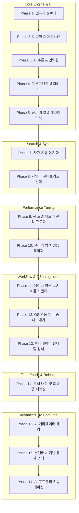

# Focal Node 개발 로드맵 및 태스크 보드 (ROADMAP.md)

본 문서는 **Focal Node (AI 로컬 사진 검색 데스크탑 앱)** 개발 진행 상황을 추적하고 각 Phase별 마일스톤을 기록하는 공식 로드맵 문서입니다.
현재 핵심 파이프라인(Phase 1 ~ Phase 8)은 모두 성공적으로 완료되었으며, 릴리즈(배포)를 위한 후반부 고도화 작업이 남았습니다.

---

## 📌 전체 개발 로드맵 아키텍처

---

## ✅ [완료] Phase 1 ~ 8 요약
* **Phase 1~3:** Tauri + FastAPI 사이드카 구동, SQLite/ChromaDB 설정, RAW(NEF) 디코딩, SigLIP/Gemma4 AI 포팅 및 비동기 인덱싱
* **Phase 4~5:** 가상화 갤러리 UI, 상세 패널(EXIF 배지 및 AI 캡션 에디터) 구현
* **Phase 7~8:** DB 자가 치유 동기화, SigLIP 기반 시맨틱 유사도 하이브리드 검색 구현

---

## 📅 [대기] Phase 9: AI 모델 메모리 관리 고도화
* **목표:** 연속적인 사진 인덱싱 과정에서 발생하는 디스크 I/O 병목 및 모델 로딩 스래싱(Thrashing) 방지.
* **상세 작업:**
  - Gemma 4 E4B-it 모델 비동기 타이머 기반 Keep-alive 로직 적용.
  - 인덱싱 큐가 비워진 후 60초 대기열 생성, 60초 경과 시 VRAM 가비지 컬렉션(해제) 자동 수행.

## 📅 [대기] Phase 10: 갤러리 탐색 성능 최적화
* **목표:** 초대형 사진 라이브러리 스크롤 시 발생하는 프레임 드랍 및 UI 렉 원천 방지.
* **상세 작업:**
  - 인덱싱 시점에 가로 360px sRGB JPEG 썸네일을 로컬 Thumbnail Cache 디렉토리에 저장.
  - API 캐시 우선 서빙 및 캐시 미스(Cache Miss) 시에만 실시간 In-Memory 디코딩 수행.

## 📅 [대기] Phase 11: 데이터 영구 보존 & 폴더 관리
* **목표:** 앱 업데이트 시 데이터 소실을 막는 DB 마이그레이션과 사이드바 폴더 제어 기능 구축.
* **상세 작업:**
  - SQLite/ChromaDB 데이터베이스 경로를 안전한 유저 앱 영역(`~/.config/focal_node/`)으로 이전
  - `IndexedFolder` 테이블 신설 및 폴더 목록 복원 API 연동
  - 폴더 단위 삭제(Un-indexing) 기능 개발

## 📅 [대기] Phase 12: OS 연동 및 다중 내보내기 (Export Workflow)
* **목표:** 로컬 파일 시스템과 강하게 연동하여 사진가들의 실무 워크플로우를 돕는 기능.
* **상세 작업:**
  - 상세 패널 내 **파인더에서 보기 (Reveal in OS)** 기능 구현 (Tauri Native Command)
  - 갤러리 사진 다중 선택(Multi-select) UX 구현
  - 선택한 사진들을 지정한 폴더로 일괄 복사(추출)하는 **Export** 백엔드 API 구현

## 📅 [대기] Phase 13: 다차원 메타데이터 필터 검색 (Metadata Filtering)
* **목표:** 자연어 검색과 EXIF 조건(카메라, ISO, 날짜 등)을 조합한 정밀 검색 구현.
* **상세 작업:**
  - 프론트엔드 드롭다운 필터 UI 구축 및 `POST /api/search` 다차원 쿼리 로직 병합

## 📅 [대기] Phase 14: 모델 배포 및 최종 앱 패키징 (Packaging)
* **목표:** 일반 유저가 원클릭으로 구동할 수 있는 독립 실행형 데스크탑 앱 빌드.
* **상세 작업:**
  - AI 모델(SigLIP+Gemma4) 런타임 동적 다운로드 로직 유지 (huggingface_hub 기반, 앱 번들 경량화)
  - PyInstaller 백엔드 패키징 및 Tauri `sidecar` 설정, 최종 `.dmg` 빌드

---

## 📅 [대기] Phase 15: 사진가 맞춤형 AI 메타데이터 태깅 (Advanced Tagging)
* **목표:** EXIF 데이터와 시각 분석을 결합하여 구도, 조명, 톤 등 사진가 전문 용어 기반 태그 자동 생성.
* **상세 작업:**
  - Gemma 4 프롬프트에 EXIF 메타데이터 주입 및 프롬프트 엔지니어링.
  - SQLite `image_metadata`에 `aesthetic_tags` 스키마 추가.
  - 프론트엔드 상세 패널에 전문 용어 전용 배지(Badge) UI 구축.

## ✅ [완료] Phase 16: 시각적 톤앤매너 기반 레퍼런스 검색 (Tone & Mood Search)
* **목표:** 텍스트 키워드 없이 컬러 그레이딩(색감)과 분위기만으로 유사한 사진을 찾는 K-NN 레퍼런스 검색 구현.
* **상세 작업:**
  - `POST /api/search/similar` 엔드포인트 신설 및 ChromaDB 벡터 쿼리 연동 완료.
  - 갤러리 및 상세 패널에 "비슷한 무드 찾기(✨ Similar)" 버튼/동작 추가 완료.

## ✅ [완료] Phase 16.1: 핵심 안정성 및 성능 결함 해결 (Bug Fix & Optimization)
* **목표:** 딥 스크롤 검색 결함, 분산 트랜잭션 DB 불일치, 모델 추론 스레드 경합 등의 구조적 결함 수정.
* **상세 작업:**
  - `search.py` 동적 Limit 스케일링 적용으로 무한 스크롤 버그 해결 완료.
  - `indexing_service.py` SQLite/ChromaDB 트랜잭션 롤백 방지 순서 조정 완료.
  - `mlx_adapters.py` 병렬 추론을 순차 처리로 변경하여 GPU 락 경합 및 병목 해소 완료.
  - `cleanup_zombie_records` 가비지 컬렉터(Garbage Collector) 연동 완료.
  - `utils/image.py` RAW 세로 썸네일 EXIF 회전(`exif_transpose`) 버그 수정 완료.

## 📅 [대기] Phase 17: 포트폴리오 큐레이션 및 AI 비평 (AI Portfolio Review)
* **목표:** 여러 장의 사진을 분석하여 포트폴리오 구성 조언 및 사진 비평(Critique)을 제공하는 인터랙티브 환경.
* **상세 작업:**
  - 여러 장의 사진 정보(태그, EXIF, 캡션)를 컨텍스트로 전달받는 `POST /api/chat/critique` API 구현.
  - 프론트엔드 다중 선택(Multi-select) 모드 및 챗봇 형태의 Curation 패널 UI 구축.
