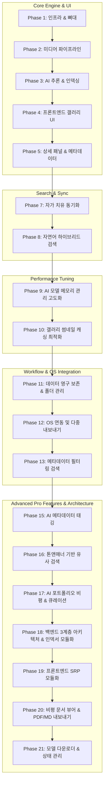

# Focal Node 개발 로드맵 및 태스크 보드 (ROADMAP.md)

본 문서는 **Focal Node (AI 로컬 사진 검색 데스크탑 앱)** 개발 진행 상황을 추적하고 각 Phase별 마일스톤을 기록하는 공식 로드맵 문서입니다.
핵심 파이프라인(Phase 1 ~ Phase 18) 및 리팩토링이 성공적으로 수행되었습니다.

---

## 📌 전체 개발 로드맵 아키텍처

```mermaid
graph TD
    subgraph Core[Core Engine & UI]
        P1[Phase 1: 인프라 & 뼈대] --> P2[Phase 2: 미디어 파이프라인]
        P2 --> P3[Phase 3: AI 추론 & 인덱싱]
        P3 --> P4[Phase 4: 프론트엔드 갤러리 UI]
        P4 --> P5[Phase 5: 상세 패널 & 메타데이터]
    end
    
    subgraph SearchSync[Search & Sync]
        P5 --> P7[Phase 7: 자가 치유 동기화]
        P7 --> P8[Phase 8: 자연어 하이브리드 검색]
    end

    subgraph Performance[Performance Tuning]
        P8 --> P9[Phase 9: AI 모델 메모리 관리 고도화]
        P9 --> P10[Phase 10: 갤러리 썸네일 캐싱 최적화]
    end
    
    subgraph Workflow[Workflow & OS Integration]
        P10 --> P11[Phase 11: 데이터 영구 보존 & 폴더 관리]
        P11 --> P12[Phase 12: OS 연동 및 다중 내보내기]
        P12 --> P13[Phase 13: 메타데이터 필터링 검색]
    end
    
    subgraph ProFeatures[Advanced Pro Features & Architecture]
        P13 --> P15[Phase 15: AI 메타데이터 태깅]
        P15 --> P16[Phase 16: 톤앤매너 기반 유사 검색]
        P16 --> P17[Phase 17: AI 포트폴리오 비평 & 큐레이션]
        P17 --> P18[Phase 18: 백엔드 3계층 아키텍처 & 인덱서 모듈화]
        P18 --> P19[Phase 19: 프론트엔드 SRP 모듈화]
        P19 --> P20[Phase 20: 비평 문서 뷰어 & PDF/MD 내보내기]
        P20 --> P21[Phase 21: 모델 다운로더 & 상태 관리]
    end
```

---

## ✅ [완료] Phase 1 ~ 8 요약
* **Phase 1~3:** Tauri + FastAPI 사이드카 구동, SQLite/ChromaDB 설정, RAW(NEF/ARW) 디코딩, SigLIP 2/Gemma 4 AI 포팅 및 비동기 인덱싱
* **Phase 4~5:** 가상화 갤러리 UI, 상세 패널(EXIF 배지 및 AI 캡션 에디터) 구현
* **Phase 7~8:** DB 자가 치유 동기화, SigLIP 2 기반 시맨틱 유사도 하이브리드 검색 구현

---

## ✅ [완료] Phase 9: AI 모델 메모리 관리 고도화
* Gemma 4 E4B-it 비동기 60초 Keep-alive 데몬 관리 적용 완료.

## ✅ [완료] Phase 10: 갤러리 썸네일 캐싱 최적화
* 인덱싱 시점 sRGB JPEG (가로 360px) 캐시 원자적 생성 및 우선 서빙 구현 완료.

## ✅ [완료] Phase 11: 데이터 영구 보존 & 폴더 관리
* SQLite/ChromaDB 경로 유저 영역(`~/.config/focal_node`) 격리 및 `IndexedFolder`, `remove_folder_data` 구현 완료.

## ✅ [완료] Phase 12: OS 연동 및 다중 내보내기 (Export Workflow)
* Tauri Native `reveal_in_finder` 연동, 사진 다중 선택 및 SSE 내보내기 API 구현 완료.

## ✅ [완료] Phase 13: 다차원 메타데이터 필터 검색 (Metadata Filtering)
* 조리개, ISO, 날짜 범위, 카메라/렌즈 메타데이터 필터와 자연어 임베딩의 하이브리드 검색 구현 완료.

## ✅ [완료] Phase 15: 사진가 맞춤형 AI 메타데이터 태깅 (Advanced Tagging)
* EXIF 메타데이터 주입, SigLIP 2 zero-shot 시각 매칭 및 `aesthetic_tags` 자동 생성을 통한 배지 UI 구축 완료.

## ✅ [완료] Phase 16: 시각적 톤앤매너 기반 레퍼런스 검색 (Tone & Mood Search)
* `POST /api/search/similar` K-NN 시각 유사도 검색 및 UI 연동 완료.

## ✅ [완료] Phase 17: AI 포트폴리오 비평 & 요약 큐레이션 (AI Critique & Curation)
* UniPercept 8B 비평 전용 모델, Gemma 4 한국어 가공/번역, `ChatService` 비평 요약 보고서 구현 완료.

## ✅ [완료] Phase 18: 백엔드 3계층 아키텍처 & 인덱서 모듈화 (Backend Refactoring)
* **목표:** 단일 책임 원칙(SRP) 준수 및 대규모 코드베이스의 높은 유지보수성 확보.
* **상세 작업:**
  - `indexing_service.py` 거대 모듈에서 상태 관리 및 동기화 이벤트를 `services/indexing_state.py`로 분리하고, 함수 단위(스캐너, 해싱, 클리닝, 워커) SRP 리팩토링 완료.
  - `SearchService` (하이브리드/K-NN 검색) 및 `ChatService` (AI 비평/요약) 비즈니스 계층 독립 완료.
  - `PhotoRepository` 및 `VectorRepository` 데이터 액세스 계층 캡슐화 완료.
  - `main.py` 슬림화 및 `run_migrations()` 캡슐화 완료.
  - 14개 백엔드 단위/통합 테스트 전 부문 100% 통과 완료.

## ✅ [완료] Phase 19: 프론트엔드 단일 책임 원칙(SRP) 모듈화 & 성능 최적화 (Frontend Refactoring)
* **목표:** 거대 모놀리식 뷰 해체, 리렌더링 성능 최적화 및 명확한 단일 목적 서브컴포넌트 구조 확보.
* **상세 작업:**
  - `CritiqueView` (752줄 ➔ `CritiqueSummaryCard`, `CritiqueCard` 분리 완료)
  - `FullscreenViewer` (648줄 ➔ `FullscreenMetadataOverlay`, `useFullscreenControls` 훅 분리 완료)
  - `Sidebar` (488줄 ➔ `FolderList`, `IndexingProgressCard` 분리 완료)
  - `AnalyticsView` (313줄 ➔ `AnalyticsKpiGrid`, `GearDonutCharts`, `ExifBarCharts` 분리 및 `use35mmMode` 캡슐화 완료)
  - `DetailPanel` (278줄 ➔ `PhotoAiAnalysisView`, `PhotoCritiqueView`, `PhotoExifView` 분리 완료)
  - `PhotoGallery` (289줄 ➔ `PhotoCard` 분리 및 `useDebounce` 적용 완료)
  - `SearchFilterMenu` (195줄 ➔ `FilterRangeInput` 도입 완료)
  - `App` (85줄 ➔ `AppSplash` 분리 완료)
  - `src/types/` 중앙 모듈화 (`photo.ts`, `critique.ts`) 및 `npx tsc --noEmit` 타입 검증 100% 통과 완료.

## ✅ [완료] Phase 20: AI 비평 문서 뷰어(Document View) 및 Markdown / PDF 내보내기 & 실시간 취소 파이프라인
* **목표:** 전문 사진 매거진 스타일의 비평 리포트 열람 경험 제공 및 파일 내보내기, 사용자 제어권 강화.
* **상세 작업:**
  - `CritiqueDocumentModal`: 단일/다중 비평을 매거진/리포트 형식으로 렌더링하는 문서 전용 모달 뷰 구현.
  - Markdown(.md) 및 PDF(.pdf) 저장: 비평 전문과 사진 EXIF 메타데이터를 정형화된 문서 파일로 로컬 저장.
  - 비평 실시간 진행 상태 모니터링: `services/critique_status.py`, `CritiqueProgressWidget`, `GlobalCritiqueToast` 연동.
  - 비평 취소(Cancel) 파이프라인: `/api/chat/critique/cancel/{photo_id}` 엔드포인트 및 모델 추론 조기 종료 메커니즘 구축.

## ✅ [완료] Phase 21: AI 모델 백그라운드 다운로더 및 상태 관리 시스템
* **목표:** 앱 최초 구동 시 무중단/원클릭 모델 설치 및 다운로드 가시성 제공.
* **상세 작업:**
  - `services/model_downloader.py`: Hugging Face Snapshot 지능형 재시도 다운로더 백그라운드 구동.
  - `/api/system/models/status` & `/api/system/models/download` 엔드포인트 구현.
  - `ModelDownloadModal`: 전체 모델 진행률(%) 및 모델별 다운로드 바, 에러 재시도 다이얼로그 제공.
  - 앱 초기화(`AppSplash`)와 다운로드 라이프사이클 통합.

---

## 🔮 [향후 로드맵 / 백로그 (Future Backlog)]

### 1. 스마트 앨범 (Smart Albums)
* **개요:** 자주 사용하는 복잡한 검색 조건(자연어 검색어 + EXIF 메타데이터 필터)을 저장해두고, 사이드바에서 원클릭으로 불러오는 개인화 프리셋 기능.
* **DB 스키마 계획 (`SmartAlbum` 테이블):**
  - `id` (VARCHAR(64), PK): UUID 고유 식별자
  - `name` (VARCHAR(100)): 앨범 명칭 (예: "야간 인물 85mm F1.4")
  - `query_text` (TEXT, Nullable): 자연어 검색어
  - `filters` (TEXT, Nullable): JSON 형태의 EXIF 필터 조건 (조리개, ISO, 날짜 범위, 카메라/렌즈 등)
  - `created_at` (DATETIME): 생성 일시
* **백엔드 API 계획:** `GET /api/smart-albums`, `POST /api/smart-albums`, `DELETE /api/smart-albums/{id}`
* **UI 계획:** 상단 액션바 `[+ Save as Smart Album]` 버튼 및 사이드바 'Smart Albums' 목록 제공.

